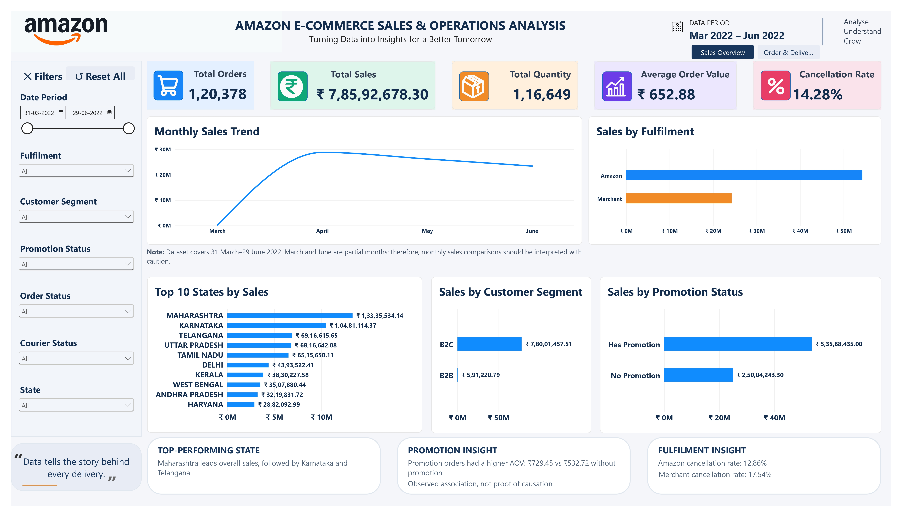
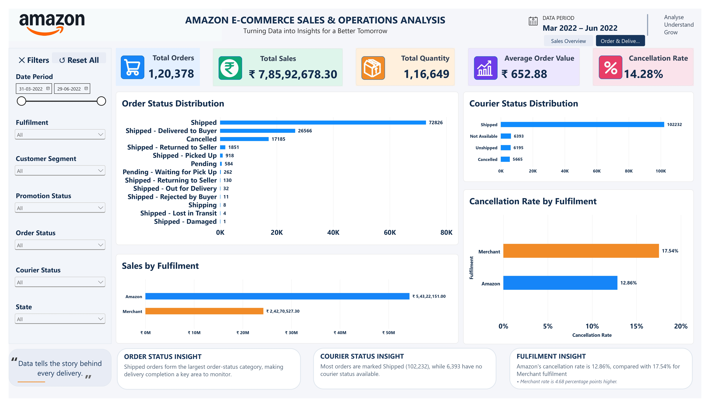

# Amazon E-Commerce Sales & Operations Analysis

### Interactive Power BI Dashboard | Excel • Power BI

An end-to-end data analytics project focused on Amazon e-commerce sales, customer segments, order fulfilment, cancellations, and delivery operations.

This project transforms raw sales data into an interactive Power BI dashboard to explore sales trends, understand order performance, and identify operational patterns.

---

## 📊 Dashboard Preview

### 1. Sales Overview

This dashboard provides an overview of sales performance, monthly trends, customer segments, fulfilment channels, promotion status, and state-wise sales.

### 2. Order & Delivery Analysis

This dashboard focuses on order status, courier status, cancellation patterns, and fulfilment-related performance.

---

## 🎥 Interactive Dashboard Demo

Watch the demo to explore dashboard navigation, slicers, filtering, and report interactions.

[▶️ Watch Interactive Dashboard Demo (MP4)](./Amazon_Ecommerce_Sales_Operations_Interactive_Demo.mp4)

---

## 📌 Project Overview

| Attribute | Details |
|---|---|
| Project Name | Amazon E-Commerce Sales & Operations Analysis |
| Domain | E-Commerce Analytics |
| Tools Used | Microsoft Excel, Power BI |
| Dataset Size | 128,975 records |
| Reporting Period | 31 March 2022 – 29 June 2022 |
| Project Type | Data Cleaning, Exploratory Analysis & Dashboard Development |

---

## 🎯 Business Objectives

- Analyze overall sales performance and order trends.
- Understand sales distribution across states and customer segments.
- Compare Amazon and Merchant fulfilment performance.
- Examine order cancellations and courier status.
- Explore sales patterns by promotion status.
- Build an interactive dashboard for business-oriented analysis.

---

## 📈 Key Performance Indicators (KPIs)

| KPI | Value |
|---|---:|
| Total Sales Amount | ₹78,592,678.30 |
| Total Orders | 120,378 |
| Total Quantity | 116,649 |
| Average Order Value (AOV) | ₹652.88 |
| Cancellation Rate | 14.28% |

*Note: These figures represent the analyzed dataset. March and June contain partial-month data.*

---

## 🔍 Key Insights

- **Sales Distribution:** B2C orders contributed approximately 99.25% of total sales.
- **Customer Segment:** B2B had a higher average order value (₹744.61) than B2C (₹652.27).
- **Fulfilment:** Amazon-fulfilled orders had a cancellation rate of approximately 12.86%, compared with 17.54% for Merchant-fulfilled orders.
- **Promotions:** Orders marked as promotional had a higher average order value (₹729.45) than orders without promotions (₹532.72).
- **Geographical Performance:** Maharashtra recorded the highest sales among the states in the analysis.

*These are descriptive findings from the dataset. Observed differences do not establish causation.*

---

## 🧹 Data Cleaning & Preparation

The dataset was prepared in Microsoft Excel before dashboard development.

Key preparation activities included:

- Handling missing values.
- Checking and removing duplicate records where applicable.
- Standardizing column names.
- Formatting date fields.
- Reviewing data types and data consistency.
- Preparing the dataset for Power BI analysis.

---

## 🛠️ Tools & Technologies

### Microsoft Excel
- Data cleaning and preparation
- Data validation
- Initial data exploration

### Microsoft Power BI
- Interactive dashboard development
- KPI cards and visualizations
- Slicers and cross-filtering
- Bookmarks and reset filters
- Multi-page report navigation

---

## 📂 Project Files

| File | Description |
|---|---|
| [Sales-Overview.png](./Sales-Overview.png) | Sales Overview dashboard screenshot |
| [Order-Delivery-Analysis.png](./Order-Delivery-Analysis.png) | Order & Delivery Analysis screenshot |
| [Amazon-Ecommerce-Sales-Operations-Analysis.pdf](./Amazon-Ecommerce-Sales-Operations-Analysis.pdf) | PDF dashboard report |
| [Interactive Demo (MP4)](./Amazon_Ecommerce_Sales_Operations_Interactive_Demo.mp4) | Dashboard walkthrough video |
| [Compressed Dataset (ZIP)](./Amazon%20Sale%20Report.csv.zip) | Compressed dataset |

---

## ⚠️ Limitations

- The dataset covers a limited reporting period.
- March and June are partial months and should not be directly compared with complete months without considering date coverage.
- The dataset does not contain cost or profit fields; therefore, profitability and profit margin are not evaluated.
- Promotion-related differences are observational and do not establish that promotions caused higher order values.
- Findings are limited to the available dataset and its recorded fields.

---

## 🚀 Project Purpose

This project was developed as part of my Data Analytics portfolio to demonstrate practical skills in data preparation, exploratory analysis, dashboard development, and business insight communication.

It is intended for portfolio review, educational viewing, and professional demonstration.

---

## 👨‍💻 Author

**Gopal Krishna**  
B.Tech CSE | Aspiring Data Analyst

- GitHub: [Gopal-42](https://github.com/Gopal-42)
- LinkedIn: [Gopal Krishna](https://www.linkedin.com/in/gopal-krishna-217b80176)

---

## © Copyright & Usage Notice

© 2026 Gopal Krishna. All Rights Reserved.

This project and its dashboard design, documentation, and original analysis are shared for educational viewing and portfolio demonstration.

Unauthorized copying, redistribution, modification, re-uploading, or claiming this work as your own is prohibited. Commercial use requires prior written permission from the author.

This notice does not override any applicable rights or license terms associated with the original dataset or third-party materials.
